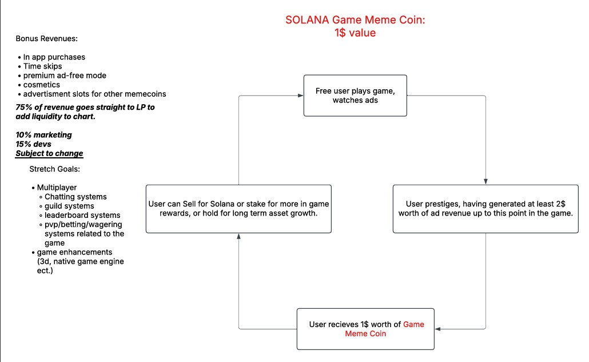

# ClickerDemo

working on something....

- the game play loop is simple. Free players play game, game is addicting. Players get served ads. players can purchase in-app purchases to skip ads. Ad revenue and in-app purchases pump the liquidity pool of the games memecoin. User receives memecoins from playing games at a rate of 1:2, meaning if the memecoin is worth 1$ then the user would have to watch/generate 2$ worth of ad watch time before receiving the memecoin. The user can stake these memecoin payouts for more ingame rewards or cash out for money. Its a self feeding cycle where funds move from advertisers into gamers/crypto bros pockets. Rebate time spent watching ads. early adopters make lots of money due to retail traders once the chart gets momentum and people start talking about the ticker and game. This is an eco system where fake projects run up to 300m, the difference being im not making a fake project.
  
- why play the game? its addicting and fun first, and you can make a couple bucks second.
- what keeps the chart from tanking and everyone just selling out? The distributioon amount per player will be so small tanking the chart due to gameplay will be impossible. Ad revenue and in app purchases will supplement any selloffs as well, feeding the chart with long term constant growth.
- what keeps players playing? a guild system, and a tie to the chart.

- This game is tied to the chart through chart %Gain or %loss. I will use an api to check the status of the chart in real-time, and use this % gain or loss as a multiplier for everyone in-game to increase or decrease click rates (prestige rates -> meme coin distribution) giving every player the incentive to hold their coins and not sell. If the chart is going super green then we can afford to distribute more coins, if it goes red then everyone's click rates will be nerfed, slowing down the mining speed, generating more ad reevenue per player due to longer play time, pumping the chart with liquidity faster... It Will Work.

# 🪙 Gold Rush Tycoon

## 📜 Concept Summary

**Gold Rush Tycoon** is a unique blend of an **idle clicker game** and a **meme coin ecosystem**. Designed to be genuinely fun and addicting, it also introduces real-world economic incentives via crypto.

### 🔑 Core Idea

- Exponential idle clicker progression.
- Meme coin (**GoldBux – GBX**) earned by playing, watching ads, and engaging.
- Ad revenue and IAPs fund the meme coin's liquidity pool.
- Free-to-play users _"earn to play"_ by simply engaging.
- Players can **stake GBX for in-game boosts**, or **sell it** on the open market.
- Dev profits come from surplus ad/IAP revenue vs. coin distribution — forming a **symbiotic loop**.

---

## ⚡️ Key Mechanic: Global Boost System

- **Green day (GBX up):** Everyone gets a Clicks-Per-Second (CPS) boost, scaled by % growth.
- **Stakers get extra boost.**
- **Red day (GBX down):** No boost — possible debuffs.
- **Real-world market performance** becomes a gameplay modifier.

---

## 🔄 Newly Added Core Features

### 🌍 Massive Decentralized Distribution
- Players earn small portions of GBX (1–5 tokens).
- Churn ensures wide, fair distribution.
- Reduces whale centralization, improves token legitimacy.

### 💵 Dual App Monetization Model
- **Free Version:** Ad-driven, standard polish.
- **Premium Version:** Ad-free, premium UX, sold separately.
- Shared backend, different front-end UX.
- Two revenue streams + "buy-in" for ad-averse players.

### 🔁 Self-Feeding Economic Loop
1. Players watch ads → generate revenue.
2. Revenue funds GBX liquidity pool.
3. Players earn GBX → stake or sell.
4. **Selling = liquidity + chart action.**
5. **Staking = gameplay boosts + retention.**

---

## 💰 Monetization Ideas

- Traditional idle IAPs: boosts, time skips, cosmetics.
- Rewarded + interstitial ads.
- **Clicker Object Auction System:**  
  Meme coin projects bid to have their coin shown as the clickable gold bar.
  - Auctioned hourly/daily.
  - Generates dev revenue and funds GBX liquidity pool.

---

## 🎮 Core Gameplay Breakdown

- **Inspired by Cookie Clicker / AdCap**
- Exponential upgrade costs.
- Linear base income + multiplicative upgrades.
- Offline progress, prestige system, critical clicks.
- Event spawns, golden moments, golden bar upgrades.
- Prestige = reset + permanent boosts.

---

## 🤝 Multiplayer / Guild Mechanics

- **Guilds:** Shared chat, icons, roles, upgrades.
- **Guild PvE:** Boss fights need pooled resources; rewards = cosmetics, GBX.
- **Guild PvP:** Wager GBX in click races.
- **Global Events:** Seasonal content based on player contribution.

---

## 🔁 User Progression & Prestige Loop

### 🧪 Stage 0: Hook & Onboarding (Prestige 0–1)
- Duration: 2–5 mins
- Instant feedback, rapid upgrades
- Unlocks:
  - Auto-clicker Tier 1
  - Manual click booster
  - Critical Click
- _Goal: Hook fast, give illusion of mastery._

### 🧪 Stage 1: Acceleration & Depth (Prestige 1–2)
- Duration: 15–30 mins
- Unlocks:
  - Guild creation/invite
  - Cosmetic shop (free items)
  - Daily login rewards
  - First "Ad Boost" (e.g., 2x coins for 30s)
- _Goal: Introduce monetization gently._

### 🧪 Stage 2: Challenge Layer (Prestige 2–3)
- Duration: 30 min – 2 hrs
- Unlocks:
  - Staking preview
  - Clicker rental display (current ad slot)
  - Guild PvE Boss Fight
  - Leaderboards
  - Manual click upgrade
- _Goal: Expand complexity._

### 🧪 Stage 3: Value Transition Layer (Prestige 3–4)
- Duration: 4–6+ hrs
- Player begins mining GBX (tiny %)
- Ads become part of natural loop
- More upgrades behind ad-watching
- Monetization > Coin Output
  - e.g. $2 in ad rev = $1 in coin output
- _Goal: Reward users but keep economy balanced._

---

## 🔄 Prestige Mechanics

- **Resets:** Clickers, upgrades, earnings.
- **Persists:** Prestige bonuses, cosmetics, guild rank, GBX balance.
- **Milestone Unlocks:** Staking, guild badges, coin drain immunity.

> Prestige 0–2: Casual & fun  
> Prestige 3–4+: Earn-to-play depth  
> Prestige 1000: Endgame stretch over decades

---

## ⚖️ Reset Loop Balance

From Prestige 3 → 4:

- Time must generate **more ad revenue** than coin value earned.
- Prevents coin inflation.
- Makes botting unprofitable.
- Rewards engaged players.

---

## 🔥 Addiction & Retention Mechanics

- Daily login streaks
- Achievements + unlockables
- Offline progress collection
- Timed multipliers
- Cosmetics (skins, particles, flex)

---

## 🧮 Economic Considerations

- Balance GBX payouts vs. game revenue
- Diminishing returns + caps for whales
- Regulatory concerns (crypto/staking)
- Scalability + server sync complexity

---

## 💡 Rebating Attention as Currency

> "Rebate your time."

Players earn tangible value (GBX) just by watching ads and playing.

- Free players get real-world value.
- Engagement = shared ecosystem growth.

---

## 📈 Investment Potential

- Idle games are proven revenue models.
- DeFi gamification is a new frontier.
- Multi-stream monetization (ads, IAPs, auctions, premium app).
- Alignment of interests: players, devs, investors.

---

## ⚠️ Possible Hurdles

- Ensuring gameplay is fun **without** crypto
- Balancing reward outputs
- Regulatory compliance
- Complex backend/server infra

---

## ✅ Next Steps

- Finalize core click loop theme
- Design prestige/reset loop
- Flesh out guild structure + chat
- Prototype gameplay
- Build economy simulation

---

## 💎 Final Brand Vision

### **Game Title:** _Gold Rush Tycoon_  
### **Tagline:** _"Stack Bars, Break Stars."_

**Core Irony:**  
Gold bars = shiny bait  
GBX = real treasure  
Flip traditional wealth — ride the crypto chaos.

---

### 🪙 Game Vibe

- **Clickable:** Gold Bar → Quantum Bars → Unobtainium  
- **Progression:** Gold Panner → Coal Mine → Government Vault → Galactic Reserve  
- **Coin:** _GoldBux (GBX)_ — earned, staked, or cashed out  
- **Visuals:** Pixel gold + neon crypto glow  
- **Tone:** Greedy, goofy, galactic

> "_Gold's for boomers. GBX is for winners."_

---

### 🔥 Addictive Hooks

- **Click Gratification:** Coins pop, gold clinks, FX flash
- **Escalation:** From dynamite mines to meteorite smelters
- **Social Flex:** Guild vaults full of Unobtainium
- **Crypto Juice:** GBX green days = hyped click boosts

---
https://1drv.ms/w/c/4be7561e3a6fd9bc/EUeJe6qWeOtIpf5IFUi4Bw8BhKlDD6XFP5MkPCSKa2-Lcw?e=9hxhpt
